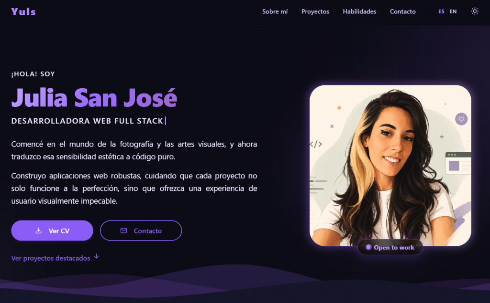

# 🌸 Yuls — Portfolio Personal

> Portafolio personal de **Julia San José**, Desarrolladora Web Full Stack y Técnica Superior en Imagen.  
> Diseñado con una mirada artística y construido con tecnología moderna.

---

## ✨ Demo en vivo

🔗 **[yuls-portafolio.vercel.app](https://yulsportafolio.vercel.app)**

---

## 📸 Vista previa



---

## 🚀 Tecnologías utilizadas

| Categoría | Tecnologías |
|---|---|
| **Framework** | React 19 + TypeScript |
| **Build tool** | Vite |
| **Estilos** | Tailwind CSS v4 + CSS personalizado |
| **Internacionalización** | i18next (🇪🇸 Español / 🇬🇧 Inglés) |
| **Iconos** | Lucide React |
| **Componentes UI** | shadcn/ui |
| **Despliegue** | Vercel |

---

## 🎨 Características

- 🌙 **Modo oscuro / claro** automático (respeta las preferencias del sistema)
- 🌍 **Bilingüe** — Español e Inglés con un solo clic
- 📱 **Diseño responsive** — 100% adaptado a móvil, tablet y escritorio
- ⚡ **Animaciones fluidas** — fade-in, typewriter, floating cards y más
- 🗂️ **Carrusel de proyectos** con paginación para mantener el diseño limpio
- 🔍 **SEO optimizado** — meta tags, Open Graph y favicon personalizado
- ♿ **Accesibilidad** — etiquetas aria, foco de teclado y contraste cuidado

---

## 📂 Estructura del proyecto

```
yuls-portafolio/
├── public/               # Imágenes, favicon y assets estáticos
├── src/
│   ├── components/       # Componentes React (Hero, About, Projects...)
│   ├── locales/          # Traducciones (es.json / en.json)
│   ├── lib/              # Utilidades
│   ├── App.tsx           # Componente raíz
│   ├── main.tsx          # Punto de entrada
│   └── index.css         # Estilos globales y tokens de diseño
├── index.html
└── vite.config.ts
```

---

## 🛠️ Instalación y desarrollo local

```bash
# 1. Clona el repositorio
git clone https://github.com/jsanjosel01/yuls-portafolio.git

# 2. Entra en el directorio
cd yuls-portafolio

# 3. Instala las dependencias
npm install

# 4. Arranca el servidor de desarrollo
npm run dev
```

Abre [http://localhost:5173](http://localhost:5173) en tu navegador.

---

## 📦 Secciones del portfolio

- **Hero** — Presentación con efecto typewriter y foto de perfil
- **Sobre Mí** — Descripción personal, habilidades clave y tarjetas bento
- **Proyectos** — 6 proyectos reales con imagen, descripción, GitHub y Demo
- **Habilidades** — Stack tecnológico organizado por categorías
- **Contacto** — Email, LinkedIn y GitHub con links directos

---

## 📁 Proyectos destacados

| Proyecto | Descripción | Demo |
|---|---|---|
| 3D Landing Page | Landing interactiva con modelos 3D | [Ver](https://jsanjosel01.github.io/Landing-3D/) |
| Galería de Animaciones | Colección de animaciones CSS/JS | [Ver](https://jsanjosel01.github.io/animaciones/) |
| Punto Objetivo Fest | Web de festival de fotografía | — |
| Precios de Gasolineras | App con API del Gobierno | [Ver](https://jsanjosel01.github.io/gasolineraApi/) |
| Tablero Kanban | Gestor de tareas drag & drop | [Ver](https://jsanjosel01.github.io/tableroKanban/) |
| EntrenaTU | Plataforma de entrenamiento personal | — |

---

## 📬 Contacto

- 📧 **Email:** [juliasjl30@gmail.com](mailto:juliasjl30@gmail.com)
- 💼 **LinkedIn:** [/in/jsanjosel](https://www.linkedin.com/in/jsanjosel/)
- 🐙 **GitHub:** [github.com/jsanjosel01](https://github.com/jsanjosel01)

---

## 📄 Licencia

Este proyecto es de uso personal. El código puede servir de inspiración, pero el diseño, los textos y las imágenes son propiedad de **Julia San José**.

---

<p align="center">Hecho con 💜 y mucho café por <strong>Yuls</strong></p>
